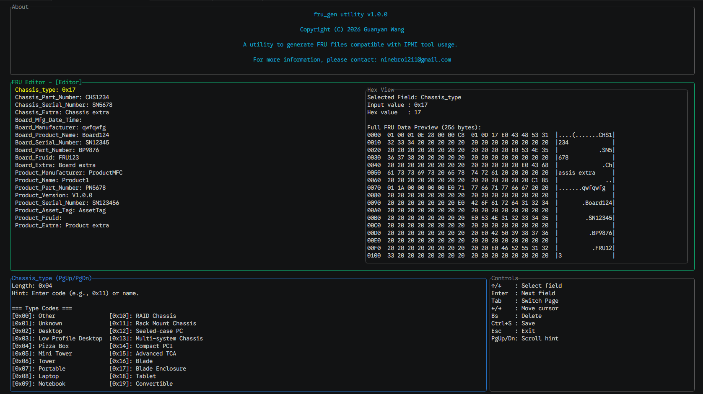
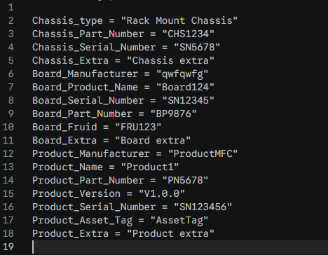

# fru_gen

This is a simple tool written in Rust that generates a FRU (Field Replaceable Unit) file compatible with `ipmitool`. The tool automatically builds the Common Header, Chassis Info Area, Board Info Area, and Product Info Area of the FRU file, ensuring each area’s checksum is correctly calculated.

## v1.0.1 Formal Release Update
- Version   : v1.0.1
- Author    : Guanyan Wang
- Date      : April 23, 2026

## Major Enhancements in v1.0.1

1. **Modernized TUI**: Improved visual style with rounded borders, color-coded sections, and native terminal background support.
2. **Multi-Page Editor**: Added a **Settings** page (switch with `Tab`) to enable/disable fields and customize reserved space for each column.
3. **Dynamic Hex View**: Real-time binary preview in `hexdump -C` format that updates instantly as you edit data or settings.
4. **Enhanced Board/Product Areas**: Added support for Board MFG Date/Time (including timestamp string parsing) and Product FRU ID to ensure full IPMI FRU specification compliance.
5. **Robust Config Loading**: Unified configuration loader that automatically detects and supports both TOML and YAML formats with fallback logic.
6. **Improved Controls**: Implemented standard `Ctrl+S` to save and `Esc` to exit without saving, plus mouse wheel support for the Hex View.
7. **Strict Spec Compliance**: Enhanced checksum calculations and 8-byte alignment padding across all areas.

## Visual Demo

### Interactive TUI Editor
The tool features a modern, multi-page terminal interface. You can edit fields in real-time and see the binary layout update instantly in the Hex View.


### Configuration Output
Settings can be saved to and loaded from human-readable YAML or TOML files.


## Use fru_gen utility

1. Install `Rust` before installing this utility. (Use Linux for example)

```Bash
curl --proto '=https' --tlsv1.2 -sSf https://sh.rustup.rs | sh
```

2. After installation of `Rust`, clone repository.

```Bash
git clone git@github.com:DavidNine/fru_gen.git
```
3. Build fru_gen utility.

```Bash
cargo build --release
```

### Build Static Binary (Recommended for compatibility)
If you encounter `GLIBC` version errors on older Linux systems, build a fully static binary using the `musl` target:

```Bash
rustup target add x86_64-unknown-linux-musl
```Bash
cargo build --release --target x86_64-unknown-linux-musl
```
The static binary will be at `target/x86_64-unknown-linux-musl/release/fru_gen`.

## Testing

The project includes a comprehensive test suite covering the CLI, utility functions, and FRU area generation.

To run all tests:
```Bash
cargo test
```

Specific test categories can be run individually:
- `cargo test --test cli_tests` (Integration tests for CLI)
- `cargo test --test lib_tests` (Library utilities)
- `cargo test --test modules_tests` (FRU area logic)

## License

This project is licensed under the MIT License. You are free to use, modify, and distribute this software; however, attribution to the original author is required. See the [LICENSE](LICENSE) file for details.
